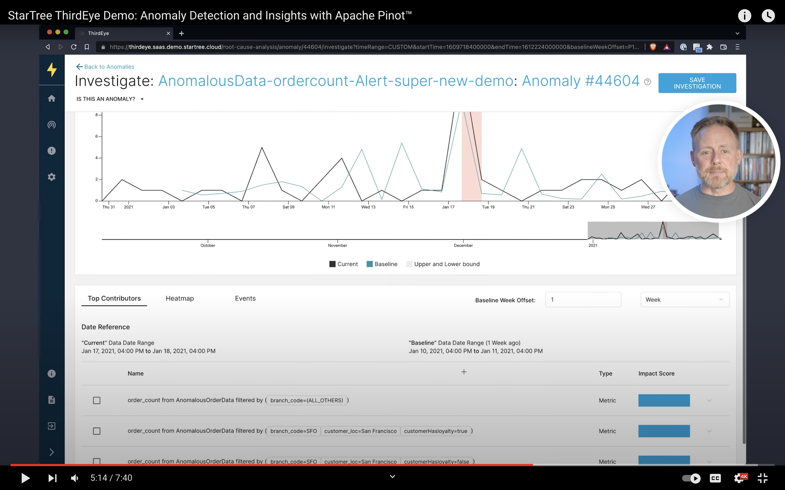
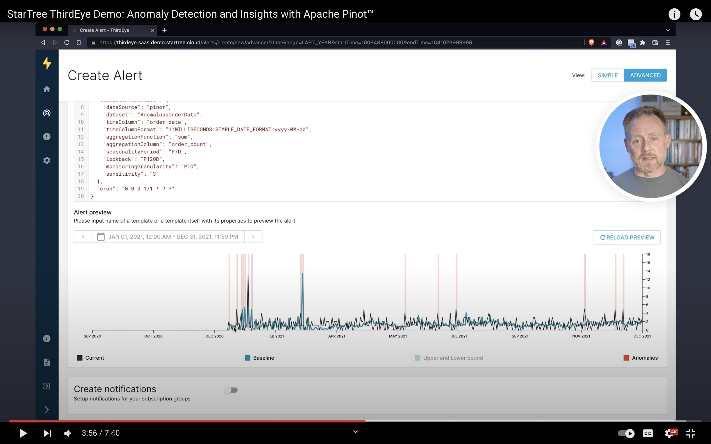
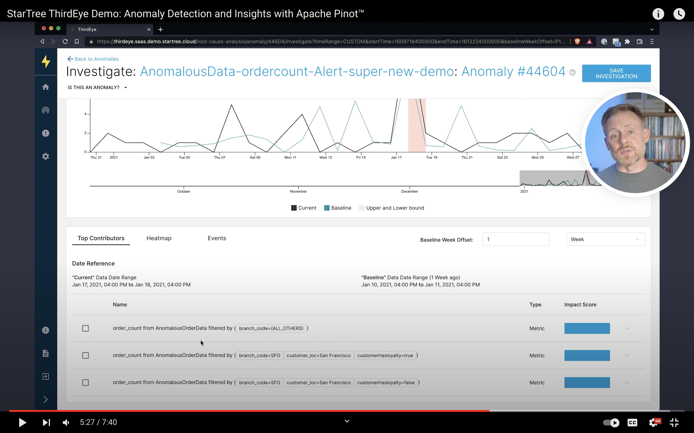
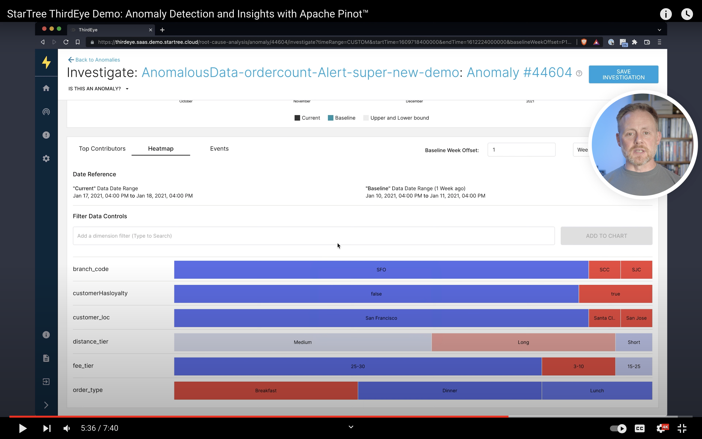
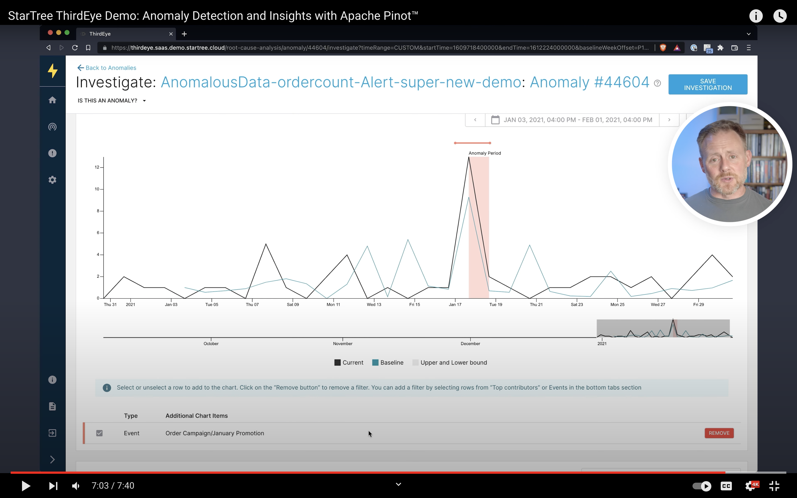

# What is ThirdEye?

ThirdEye is an integrated tool for realtime monitoring of time series and interactive root-cause analysis. 
It enables anyone inside an organization to collaborate on effective identification and analysis of deviations in 
business and system metrics. ThirdEye supports the entire workflow from anomaly detection, over root-cause analysis, 
to issue resolution and post-mortem reporting.


**Watch the introduction video**
[](https://www.youtube.com/watch?v=XhaLcpiPUS0 "Watch ThirdEye introduction video")

<details><summary>... or read the summary</summary>

## What is it for? (key features)

Online monitoring and analysis of business and system metrics from multiple data sources. ThirdEye comes batteries included for both detection and analysis use cases. It aims to minimize the Mean-Time-To-Detection (MTTD) and Mean-Time-To-Recovery (MTTR) of production issues. ThirdEye improves its detection and analysis performance over time from incremental user feedback.

**Detection**
* Detection toolkit based on business rules and exponential smoothing
  * Realtime monitoring of high-dimensional time series
  * Native support for seasonality and permanent change points in time series
  * Email alerts with 1-click feedback for automated tuning of detection algorithms

**Root-Cause Analysis**
* Collaborative root-cause analysis dashboards
  * Interactive slice-and-dice of data, correlation analysis, and event identification
  * Reporting and archiving tools for anomalies and analyses
  * Knowledge graph construction over time from user feedback

**Integration**
* Connectors for continuous time series data from Pinot, Presto, MySQL and CSV
  * Connectors for discrete event data sources, such as holidays from Google calendar
  * Plugin support for detection and analysis components

## What it isn't? (limitations)

ThirdEye maintains a dedicated meta-data store to capture data sources, anomalies, and relationships between entities but does not store raw time series data. It relies on systems such as Pinot, Presto, MySQL, RocksDB, and Kafka to obtain both realtime and historic time series data.

ThirdEye does not replace your issue tracker - it integrates with it. ThirdEye supports collaboration but focuses on the data-integration aspect of anomaly detection and root-cause analysis. After all, your organization probably already has a well-oiled issue resolution process that we don't want to disrupt.

ThirdEye is not a generic dashboard builder toolkit. ThirdEye attempts to bring overview data from different sources into one single place on-demand. In-depth data about events, such as A/B experiments and deployments, should be kept in their respective systems. ThirdEye can link to these directly.
</details>

## Documentation

For a complete description of ThirdEye's features, see [**ThirdEye documentation**](https://dev.startree.ai/docs/startree-enterprise-edition/startree-thirdeye/). 

- [**Getting started**](https://dev.startree.ai/docs/startree-enterprise-edition/startree-thirdeye/getting-started/)
- [**Data Sources Setup**](https://dev.startree.ai/docs/startree-enterprise-edition/startree-thirdeye/how-tos/database/)
- [**Alert Setup**](https://dev.startree.ai/docs/startree-enterprise-edition/startree-thirdeye/concepts/alert-configuration)


## Features

| Alert simulation                                                                                                               | Automatic root cause analysis                                                                                                    |
|--------------------------------------------------------------------------------------------------------------------------------|----------------------------------------------------------------------------------------------------------------------------------|
| [](https://youtu.be/XhaLcpiPUS0?t=210 "Alert evaluation with ThirdEye") | [](https://youtu.be/XhaLcpiPUS0?t=306 "Top contributors in ThirdEye") |
| Interactive slice-and-dice heatmap                                                                                             | Correlated events analysis                                                                                                       |
| [](https://youtu.be/XhaLcpiPUS0?t=328 "Heatmap in Thirdeye")                          | [](https://youtu.be/XhaLcpiPUS0?t=406 "Events in ThirdEye")                               |

## Build

### Requirements
- tested on Linux and Mac OS
- Java 11
- MySQL 8.0
- the UI requires internal npm packages. Make sure you can access them. See [thirdeye-ui prerequisites](./thirdeye-ui/README.md#configure-node-package-manager-npm-for-use-with-artifactory)

### Database setup
If you have MySQL 8.0 installed, run `scripts/db-setup.sh`. This script uses the `root` user to 
create the database and tables.

Alternatively, you can use docker to launch mysql. Simply execute `scripts/mysql-docker-start.sh`

### Build with Maven

ThirdEye is a maven project and uses standard maven commands.   
```
# Build ThirdEye from source
./mvnw -T 1C install

# To skip tests during build
./mvnw -T 1C install -DskipTests

# If you are working on backend, You may skip the ui module
./mvnw -T 1C install -pl '!thirdeye-ui'

# To Skip Integration tests
./mvnw -T 1C install -pl '!thirdeye-integration-tests'
```

### Running ThirdEye from Distribution

ThirdEye builds a tarball and creates an installed dir post build.  
ThirdEye has 3 main components all of which start from a single launcher  
- **Coordinator**: This is the API server which exposes a swagger endpoint that will be used in this guide
- **Scheduler**: This is the component that runs the cron jobs and automated pipelines
- **Worker**: This is the component that does all the hard work: running detection tasks and generating anomalies.
```
# cd to the distribution dir
cd thirdeye-distribution/target/thirdeye-distribution-*-SNAPSHOT-dist/thirdeye-distribution-*-SNAPSHOT

# Run the coordinator
# To run a scheduler, enable scheduler.enabled: true inside the configuration
# To run a worker, enable taskDriver.enabled: true inside the configuration

# To load plugins, export the plugin directory
export THIRDEYE_PLUGINS_DIR="${PWD}/plugins"

# Run the server
bin/thirdeye.sh server 
```

### Docker

Once a distribution is ready, you can simply package it into a docker container using the command below.

```SHELL
./mvnw -T 1C package -D skipTests && docker build -t thirdeye:latest .
```

#### Start ThirdEye Coordinator
```SHELL
docker run \
    --name  thirdeye-coordinator \
    -p 8081:8080 \
    -d thirdeye:latest coordinator
```

#### Start ThirdEye worker
```SHELL
docker run \
    --name  thirdeye-worker \
    -p 8081:8080 \
    -d thirdeye:latest worker
```

## Developer Guide

See [DEVELOPMENT.md](DEVELOPMENT.md)

# License FAQ

Please refer to the License FAQ section at https://www.startree.ai/legal
