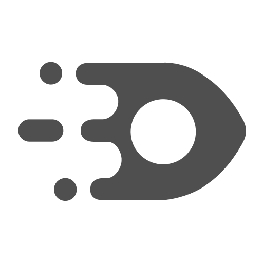

# ThirdEye UI

[](https://github.com/startreedata/thirdeye/actions?query=workflow%3A%22ThirdEye+UI+Workflow%22)

<br/>

This is the UI project for StarTree ThirdEye.

-   [Getting Started](#getting-started)
    -   [Prerequisites](#prerequisites)
        -   [Node Version Manager (nvm)](#node-version-manager-nvm)
        -   [Configure Node Package Manager (npm) for use with Artifactory](#configure-node-package-manager-npm-for-use-with-artifactory)
    -   [Setup](#setup)
    -   [Run](#run)
-   [Supported Browsers](#supported-browsers)
-   [Scripts](#scripts)
    -   [`start`](#start)
    -   [`build`](#build)
    -   [`test`](#test)
    -   [`test-watch`](#test-watch)
    -   [`test-coverage`](#test-coverage)
    -   [`test-e2e`](#test-e2e)
    -   [`test-e2e-gui`](#test-e2e-gui)
    -   [`eslint-check`](#eslint-check)
    -   [`eslint-fix`](#eslint-fix)
    -   [`stylelint-check`](#stylelint-check)
    -   [`stylelint-fix`](#stylelint-fix)
    -   [`prettier-check`](#prettier-check)
    -   [`prettier-fix`](#prettier-fix)
    -   [`lint`](#lint)
-   [Contributing](#contributing)

## Getting Started

These instructions will help you get the project up and running on your local machine for development and testing purposes.

### Prerequisites

#### [Node Version Manager (nvm)](https://github.com/nvm-sh/nvm)

The project uses nvm to maintain the [Node](https://nodejs.org) version. Compatible Node version is listed in project root [**.nvmrc**](./.nvmrc). Follow the instructions to install nvm for [Linux/macOS](https://github.com/nvm-sh/nvm#installing-and-updating) or [Windows](https://github.com/coreybutler/nvm-windows#installation--upgrades).

Once you install nvm, go to the project directory and switch to the compatible Node version

```
$ nvm use
```

This will switch to the required Node version if already installed and make `npm` command available in the terminal.

If the required Node version is not installed, it will recommend the command to install it

```
Found '/Users/default/thirdeye/thirdeye-ui/.nvmrc' with version <14.7.0>
N/A: version "14.7.0 -> N/A" is not yet installed.

You need to run "nvm install 14.7.0" to install it before using it.
```

Following the installation, the command above will let you switch to the required Node version.

:warning: `nvm use` (without version number) might not work when using nvm for [Windows](https://github.com/coreybutler/nvm-windows). You may need to specify precise Node version from project root [**.nvmrc**](./.nvmrc).

#### Configure [Node Package Manager (npm)](https://www.npmjs.com) for use with [Artifactory](https://repo.startreedata.io)

The project may depend on some packages to be installed from Artifactory and npm needs to be configured to allow access to these packages.
The Artifactory repository to install packages from is configured in project root [**.npmrc**](./.npmrc).

You need to append your credentials to [**.npmrc**](./.npmrc) to access the Artifactory.

-   Go to [https://repo.startreedata.io/ui/admin/artifactory/user_profile](https://repo.startreedata.io/ui/admin/artifactory/user_profile). You can connect with the Okta SSO.
-   Create an API key
-   Run the request:

```shell
curl -H "X-JFrog-Art-Api:[YOUR_API_KEY]" https://repo.startreedata.io/artifactory/api/npm/auth
```

This will return HTTP basic auth credentials:

    _auth = VERY_LONG_BASE_64_TOKENY3lyaWxAc3RhcnRyZWUuYWNG1lcVBiS0QyRjJhN3M3Qm9uV1dkV2FxbzVWNVJraWF0Z2sxbmViYVVmeFpqZ1NTMw==
    always-auth = true
    email = your_name@startree.ai

-   Append these credentials to the [**.npmrc**](./.npmrc) file.

To avoid making tracked changes to this project, you can also copy [**.npmrc**](./.npmrc) in your shared **user** `~/.npmrc`
file.

### Setup

Once you clone the repository, go to the project directory and install

```
$ npm install
```

This will install necessary dependencies for the project.

:warning: In case `npm` errors out with `cb() never called` message, remove the **node-modules** directory, **package-lock.json** lockfile and run

```
$ npm cache clean --force
```

### Run

Once set up, go to the project directory and run

```
$ npm run start
```

This will build and deploy the project using [webpack-dev-server](https://github.com/webpack/webpack-dev-server) at http://localhost:7004.

Note that configuration for the proxy to the `/api` endpoint is located in `webpack.config.dev.js` under `devServer.proxy`. Currently
this points to the [Azure demo deployment](https://cortexdata.atlassian.net/wiki/spaces/CORTEXDATA/pages/1278541825/ThirdEye+Demo+Environment+-+Azure).
For interacting with dev instance of ThirdEye, you should the proxy to `http://localhost:8080`.

## Supported Browsers

StarTree ThirdEye UI is tested on latest, stable release of [Chrome](https://www.google.com/chrome), [Firefox](https://www.mozilla.org/firefox), [Safari](https://www.apple.com/safari) and [Edge](https://www.microsoft.com/edge).

## Scripts

### `start`

Build and deploy the project using [webpack-dev-server](https://github.com/webpack/webpack-dev-server) at http://localhost:7004

```
$ npm run start
```

### `build`

Build the project and output the bundles in project root **dist**

```
$ npm run build
```

This will also analyze the bundles using [Webpack Bundle Analyzer](https://github.com/webpack-contrib/webpack-bundle-analyzer) and generate bundle report in project root **webpack**.

### `test`

Run all tests

```
$ npm run test
```

### `test-watch`

Watch files for changes and re-run tests related to changed files

```
$ npm run test-watch
```

### `test-coverage`

Run all tests and generate coverage report in project root **src/test/unit/coverage**

```
$ npm run test-coverage
```

### `test-e2e`

Run all end to end tests headlessly using [Cypress](https://www.cypress.io)

```
$ npm run test-e2e
```

By default, tests are run in Electron headless browser. To change the browser, use [`--browser`](https://docs.cypress.io/guides/guides/command-line#cypress-run-browser-lt-browser-name-or-path-gt) command line option. Other than the default `electron` browser, `chrome`, `chromium`, `edge` and `firefox` browsers are supported as long as they are installed locally

```
$ npm run test-e2e -- --browser edge
```

### `test-e2e-gui`

Run all end to end tests using [Cypress Test Runner](https://docs.cypress.io/guides/core-concepts/test-runner)

```
$ npm run test-e2e-gui
```

### `eslint-check`

Run [ESLint](https://eslint.org) across the project except for files and directories listed in project root [**.eslintignore**](./.eslintignore) and check for issues

```
$ npm run eslint-check
```

### `eslint-fix`

Run [ESLint](https://eslint.org) across the project except for files and directories listed in project root [**.eslintignore**](./.eslintignore) and fix issues

```
$ npm run eslint-fix
```

### `stylelint-check`

Run [stylelint](https://stylelint.io) across the project except for files and directories listed in project root [**.stylelintignore**](./.stylelintignore) and check for issues

```
$ npm run stylelint-check
```

### `stylelint-fix`

Run [stylelint](https://stylelint.io) across the project except for files and directories listed in project root [**.stylelintignore**](./.stylelintignore) and fix issues

```
$ npm run stylelint-fix
```

### `prettier-check`

Run [Prettier](https://prettier.io) across the project except for files and directories listed in project root [**.prettierignore**](./.prettierignore) and check for issues

```
$ npm run prettier-check
```

### `prettier-fix`

Run [Prettier](https://prettier.io) across the project except for files and directories listed in project root [**.prettierignore**](./.prettierignore) and fix issues

```
$ npm run prettier-fix
```

### `lint`

Run [`eslint-fix`](#eslint-fix), [`stylelint-fix`](#stylelint-fix) and [`prettier-fix`](#prettier-fix) scripts

```
$ npm run lint
```

## Contributing

[Coding standards, conventions and other things.](./CONTRIBUTING.md)
